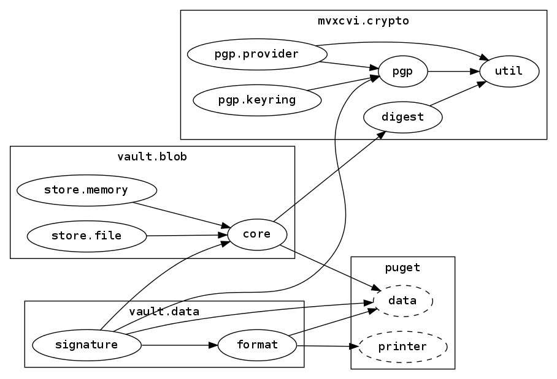

lein-hiera
==========

Generates a graph of the dependency hierarchy of a set of clojure files. This
uses the [clojure.tools.namespace](https://github.com/clojure/tools.namespace)
library for namespace parsing and [Rhizome](https://github.com/ztellman/rhizome)
for graph generation using [Graphviz](http://www.graphviz.org/).

This plugin is inspired by
[lein-ns-dep-graph](https://github.com/hilverd/lein-ns-dep-graph), but has many
additional options for graph generation.

## Usage

Add `[lein-hiera "0.8.0"]` into the `:plugins` vector of your
`:user` profile, then run:

    $ lein hiera

This will generate a dependency graph in `target/dependencies.png`, showing the
interdependency of the project's source namespaces. By default, all directories
in the project's `:source-paths` are included. Additional directories to include
may be given as command-line arguments:

    $ lein hiera ../foo-lib/src ../bar-lib/src

## Example

This image shows the dependency hierarchy from a moderately complex project. The
namespaces are clustered by two levels, and it shows a dependency on the external
`puget` library.



## Options

Graph generation may be controlled with additional options under the `:hiera`
key in the project map. The available options, and their default values are:

```clojure
:hiera
{:path "target/dependencies.png"
 :vertical? true
 :show-external? false
 :cluster-depth 0
 :trim-ns-prefix true
 :ignore-ns #{}}
```

| name | description |
|------|-------------|
| `:path` | Gives the location to output the graph image to. |
| `:vertical?` | Specifies whether to lay out the graph vertically or horizontally. |
| `show-external?` | When set, the graph will include nodes for namespaces which are not defined in the source files, marked by a dashed border. |
| `:cluster-depth` | Sets the number of namespace segments to cluster nodes by. Clusters must contain at least one fewer segment than the nodes themselves. |
| `:trim-ns-prefix` | When set, clustered namespaces will have the cluster prefix removed from the node labels. |
| `:ignore-ns` | A set of namespace prefixes to exclude from the graph. For example, `#{clojure}` would exclude `clojure.string`, `clojure.java.io`, etc. |

## License

This is free and unencumbered software released into the public domain.
See the UNLICENSE file for more information.
